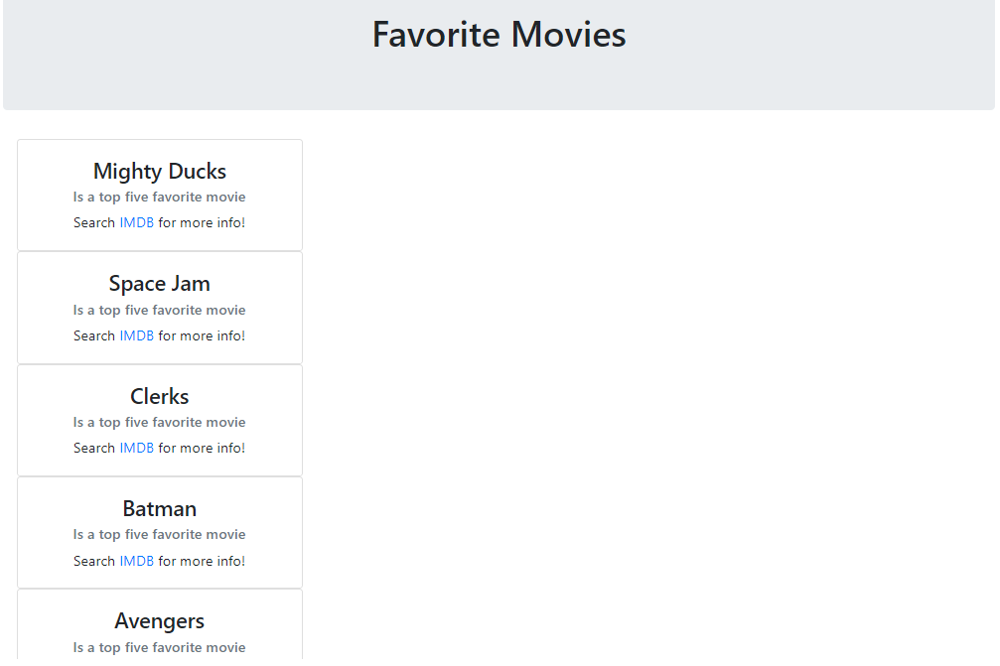

# FavoriteMovie--App

## Background

Create a web app that will display a list of your top five favorite movies.

## Goals

* Create a Dictionarie or xml file with your top 5 movies name.

* Create back-end using python and flask.

* Create Front-end page using bootstrap.

* Add style to your webpage by using [Bootstrap cards](https://getbootstrap.com/docs/4.0/components/card/). 

* Add additional movie information, such as a link to IMDB.

## Run Locally

Run this command git clone https://github.com/meuwebsite/FavoriteMovie--App/

Make sure you have installed in your computer all libraries used above

Double check if you are in the right directory in you terminal ...that often cause errors

Terminal Should be addressed at folder: flask_app

Run the command: python app.py in your terminal

Copy the output link and paste in your Browser

You are now in the dev environment and you can play around
